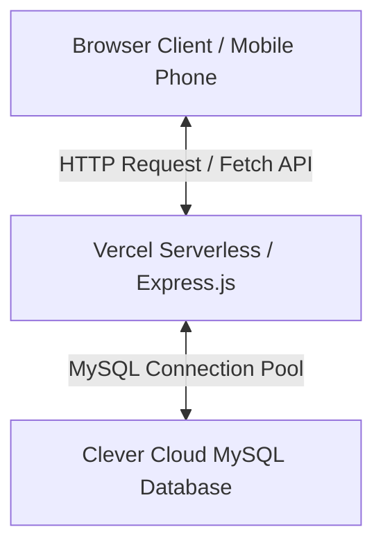

# 🏍️ Platform Website Dealer Motor Suzuki (Dinamis & Responsif)

Platform web dinamis yang dirancang khusus untuk kebutuhan informasi, katalog produk, perbandingan spesifikasi, dan simulasi kredit dealer motor Suzuki Indonesia. Proyek ini memadukan **Frontend statis modern & interaktif** dengan **Backend serverless Node.js/Express** yang terhubung langsung ke database cloud **MySQL**.

Proyek ini telah dioptimalkan secara mendalam agar dapat berjalan di lingkungan produksi awan secara **100% gratis** menggunakan **Vercel** (untuk hosting aset statis dan API serverless) serta **Clever Cloud** (untuk database MySQL online).

---

## 📌 Daftar Isi
1. [Fitur Utama Website](#-fitur-utama-website)
2. [Spesifikasi Teknologi (Tech Stack)](#-spesifikasi-teknologi-tech-stack)
3. [Arsitektur Sistem](#-arsitektur-sistem)
4. [Skema Database & Relasi](#-skema-database--relasi)
5. [Dokumentasi API Endpoints](#-dokumentasi-api-endpoints)
6. [Struktur Direktori Proyek](#-struktur-direktori-proyek)
7. [Panduan Jalankan Lokal (Local Development)](#-panduan-jalankan-lokal-local-development)
8. [Panduan Deployment Online (Production)](#-panduan-deployment-online-production)
9. [Optimasi Performa & Keamanan](#-optimasi-performa--keamanan)
10. [Catatan Perbaikan Bug & Kompatibilitas](#-catatan-perbaikan-bug--kompatibilitas)

---

## 🚀 Fitur Utama Website

### 1. Beranda (Home Page)
* **Informasi Dealer**: Menampilkan profil singkat dealer Suzuki, keunggulan layanan, data statistik penjualan, dan kontak sales resmi (WhatsApp & Email).
* **Slider Hero & Navigasi**: Menu navigasi yang bersih dan transisi halus untuk mempermudah akses ke berbagai area website.
* **Motor Unggulan Dinamis**: Bagian rekomendasi motor di halaman beranda me-render data dari database MySQL online secara real-time. Jika data di database berubah, konten beranda langsung ter-update otomatis.

### 2. Katalog Motor Interaktif
* **Daftar Motor Dinamis**: Menampilkan seluruh jajaran produk Suzuki (Matic, Sport, Adventure) secara terstruktur lengkap dengan harga OTR (On The Road).
* **Live Search**: Pengguna dapat mencari motor secara instan dengan mengetikkan nama motor. Pencarian dilakukan di sisi klien berdasarkan data database.
* **Filter Tipe**: Mempermudah penyaringan daftar produk berdasarkan kategori: **Matic**, **Sport**, atau **Adventure**.

### 3. Detail Motor Lengkap & Interaktif
* **Spesifikasi Teknis**: Menampilkan detail spesifikasi mesin, transmisi, konsumsi BBM rata-rata, berat kendaraan, serta poin-poin keunggulan motor.
* **Color Switcher Interaktif**: Mengubah gambar visual motor secara dinamis di layar saat pengunjung mengeklik palet pilihan warna yang tersedia.
* **Integrasi Video YouTube**: Embed pemutar video review YouTube secara dinamis sesuai tautan video yang tersimpan di database.

### 4. Bandingkan Motor (Side-by-Side Comparison)
* Memungkinkan calon pembeli memilih dua jenis motor Suzuki yang berbeda dari menu dropdown.
* Menampilkan perbandingan spesifikasi teknis dan harga OTR secara berdampingan untuk membantu calon pembeli mengambil keputusan.

### 5. Kalkulator Cicilan & Simulasi Kredit
* **Simulasi Angsuran**: Menghitung secara otomatis nominal angsuran bulanan berdasarkan harga OTR motor, persentase Down Payment (DP)/Uang Muka pilihan, serta durasi tenor (12 bulan, 24 bulan, atau 36 bulan).
* **WhatsApp Sales Integration**: Tombol khusus yang menyusun ringkasan rincian hasil kredit pilihan pengguna menjadi pesan teks terformat rapi dan membuka aplikasi WhatsApp secara otomatis untuk langsung terhubung dengan sales dealer.

### 6. Panel Admin & Dashboard Manajemen
* **Autentikasi Admin**: Halaman login aman untuk memverifikasi identitas administrator dealer.
* **Dashboard Summary**: Menampilkan statistik ringkas database seperti jumlah total motor terdaftar, rata-rata harga motor, dan timestamp pembaharuan data terakhir.
* **Form Edit Data**: Memungkinkan admin mengubah harga OTR, spesifikasi teknis, poin keunggulan, serta URL video review YouTube dari setiap motor langsung dari browser.

---

## 🛠️ Spesifikasi Teknologi (Tech Stack)

### Frontend (Client-side)
* **HTML5**: Struktur halaman semantik dan SEO-friendly.
* **Vanilla CSS3**: Desain visual premium menggunakan CSS Variables, sistem tata letak Flexbox/Grid, transisi interaktif, serta Media Queries untuk adaptasi tampilan perangkat mobile.
* **Vanilla JavaScript**: Logika logika interaktif, kalkulasi matematika simulasi kredit, manipulasi DOM dinamis, serta pengambilan data asinkronus menggunakan **Fetch API**.

### Backend (Server-side)
* **Node.js**: Runtime environment javascript server-side.
* **Express.js (v5)**: Kerangka kerja (framework) web minimalis untuk mengelola perutean statis dan API endpoints.
* **MySQL2**: Driver penghubung database MySQL berkinerja tinggi yang dikonfigurasi menggunakan **Connection Pool**.
* **Dotenv**: Pengelolaan kredensial sensitif seperti variabel lingkungan (environment variables) secara aman.

### Database & Cloud Platform
* **Clever Cloud (MySQL)**: Penyimpanan basis data relasional MySQL online secara cloud gratis dengan performa stabil.
* **Vercel Serverless Functions**: Hosting server web Express dan file statis secara bersamaan dengan model Serverless Architecture.

---

## 📐 Arsitektur Sistem

Aplikasi ini menggunakan model arsitektur 3-tier: Client (Browser), Application Server (Vercel Serverless Express), dan Database Server (Clever Cloud MySQL).



---

## 🗄️ Skema Database & Relasi

Basis data proyek ini terdiri dari 3 tabel utama yang saling berelasi:

### 1. Tabel `admins`
Tabel ini digunakan untuk menyimpan kredensial admin yang berhak melakukan pengelolaan data motor melalui panel dashboard admin.
| Kolom | Tipe Data | Keterangan |
| :--- | :--- | :--- |
| `id` | `INT(11)` | Primary Key, Auto Increment |
| `username` | `VARCHAR(50)` | Unique Key, Username login admin |
| `password` | `VARCHAR(255)` | Kata sandi login admin |
| `nama_lengkap`| `VARCHAR(100)` | Nama lengkap admin pengelola |

### 2. Tabel `motors`
Tabel ini menyimpan data utama produk motor Suzuki beserta spesifikasi teknisnya.
| Kolom | Tipe Data | Keterangan |
| :--- | :--- | :--- |
| `id` | `INT(11)` | Primary Key, Auto Increment |
| `nama_motor` | `VARCHAR(100)` | Nama model motor Suzuki |
| `tipe` | `ENUM('Matic','Sport','Adventure')` | Kategori tipe motor |
| `mesin` | `VARCHAR(100)` | Kapasitas dan tipe mesin (e.g., '150cc') |
| `transmisi` | `VARCHAR(100)` | Jenis sistem transmisi motor |
| `konsumsi_bbm`| `VARCHAR(100)` | Estimasi konsumsi bahan bakar |
| `berat` | `VARCHAR(50)` | Berat total kendaraan |
| `keunggulan` | `TEXT` | Daftar poin-poin keunggulan motor (dipisah newline) |
| `harga` | `INT(11)` | Harga On-The-Road (OTR) dalam rupiah |
| `gambar_motor`| `VARCHAR(255)` | Path nama berkas gambar utama motor |
| `pilihan_warna`| `VARCHAR(255)` | Daftar kode warna hex (dipisah koma) |
| `updated_at` | `TIMESTAMP` | Waktu pembaharuan data terakhir (otomatis) |
| `link_youtube`| `VARCHAR(255)` | Tautan penuh URL video review YouTube |

### 3. Tabel `motor_variants`
Tabel ini menyimpan variasi warna dan gambar visual spesifik untuk fitur *Color Switcher* di halaman detail motor.
| Kolom | Tipe Data | Keterangan |
| :--- | :--- | :--- |
| `variant_id` | `INT(11)` | Primary Key, Auto Increment |
| `motor_id` | `INT(11)` | Foreign Key ke `motors(id)` (ON DELETE CASCADE) |
| `color_name` | `VARCHAR(50)` | Nama varian warna (e.g., 'Champion Yellow') |
| `color_hex` | `VARCHAR(10)` | Kode Hexadecimal warna (e.g., '#FFD514') |
| `variant_image`| `VARCHAR(255)` | Nama berkas gambar varian motor tersebut |

---

## 🔌 Dokumentasi API Endpoints

Semua komunikasi data antara client frontend dan database MySQL dijembatani oleh API endpoints berikut:

### 1. Autentikasi Admin
* **Endpoint**: `POST /api/login`
* **Request Body**:
  ```json
  {
    "username": "admin",
    "password": "admin123"
  }
  ```
* **Respons Sukses (`200 OK`)**:
  ```json
  {
    "success": true,
    "message": "Login berhasil!",
    "user": {
      "id": 1,
      "username": "admin",
      "nama_lengkap": "Tim Digital Marketing"
    }
  }
  ```
* **Respons Gagal (`401 Unauthorized`)**:
  ```json
  {
    "success": false,
    "message": "Username atau Password salah!"
  }
  ```

### 2. Mengambil Semua Data Motor & Summary Stats
Mengambil seluruh data motor, daftar varian warna per motor, serta metrik ringkasan untuk dashboard admin secara efisien.
* **Endpoint**: `GET /api/motors`
* **Respons Sukses (`200 OK`)**:
  ```json
  {
    "motors": [
      {
        "id": 1,
        "nama_motor": "Suzuki Burgman Street 125Ex",
        "tipe": "Matic",
        "mesin": "125cc",
        "transmisi": "Automatic CVT",
        "konsumsi_bbm": "52,6km/L",
        "berat": "111 kg",
        "keunggulan": "• Ruang pijakan kaki luas\n• Desain elegan...",
        "harga": 28350000,
        "gambar_motor": "Burgman.png",
        "pilihan_warna": "#04396c,#000000,#424242,#ffffff",
        "updated_at": "2026-06-23T04:14:05.000Z",
        "link_youtube": "https://youtu.be/_H4q08qg1Rs",
        "variants": [
          {
            "variant_id": 1,
            "motor_id": 1,
            "color_name": "Biru",
            "color_hex": "#04396c",
            "variant_image": "Burgman.png"
          },
          ...
        ]
      }
    ],
    "summary": {
      "total_motor": 9,
      "rata_harga": 32800000,
      "terakhir_update": "2026-06-23T08:51:48.000Z"
    }
  }
  ```

### 3. Mengambil Detail Satu Motor
* **Endpoint**: `GET /api/motors/:id` (ganti `:id` dengan ID motor, contoh: `/api/motors/1`)
* **Respons Sukses (`200 OK`)**:
  ```json
  {
    "id": 1,
    "nama_motor": "Suzuki Burgman Street 125Ex",
    "tipe": "Matic",
    "harga": 28350000,
    ...
  }
  ```

### 4. Memperbarui Data Motor
Admin dapat memperbarui satu atau beberapa data spesifikasi/harga motor sekaligus.
* **Endpoint**: `PUT /api/motors/:id`
* **Request Body** (dapat mengirim field secara opsional):
  ```json
  {
    "harga": 29000000,
    "mesin": "125cc SEP-alpha",
    "keunggulan": "• Bagasi luas\n• Mesin Irit SEP-α"
  }
  ```
* **Respons Sukses (`200 OK`)**:
  ```json
  {
    "success": true,
    "message": "Data motor berhasil diperbarui!"
  }
  ```

---

## 📁 Struktur Direktori Proyek

```text
FINALLLLL WEB SUZUKI/
│
├── server.js                 # File utama server Node.js/Express (Backend)
├── package.json              # File definisi dependensi proyek Node.js
├── vercel.json               # Konfigurasi perutean & bundle Vercel Serverless
├── db_suzuki.sql             # SQL Dump skema tabel & data awal database
├── .env                      # Variabel lingkungan database lokal (Sensitif)
│
├── BERANDA/                  # Folder halaman utama website
│   ├── index_beranda.html    # Halaman utama dealer Suzuki
│   └── IMG/                  # Aset logo, banner, dan ikon beranda
│
├── KATALOG/                  # Folder katalog produk & detail
│   ├── katalog.html          # Halaman daftar motor, search, & filter
│   ├── detail_motor.html     # Halaman spesifikasi, switcher warna, & video
│   └── source/               # Aset gambar katalog beresolusi tinggi (.png)
│
├── BANDING MOTOR/            # Fitur pembanding spesifikasi motor
│   └── index_bm.html         # Halaman antarmuka komparasi side-by-side
│
├── HASIL KALKULATOR/         # Folder simulasi cicilan & kredit
│   ├── index_hk.html         # Halaman utama kalkulator cicilan
│   ├── index_hk Satria Pro.html
│   ├── index_hk Nextcrossover.html
│   └── ... (Halaman kalkulator simulasi motor lainnya)
│
├── ADMIN/                    # Halaman akses login administrator
│   └── index Admin.html      # Form login admin
│
└── BERANDA ADMIN/            # Dashboard panel admin pengelola data
    └── index BA.html         # Antarmuka pengelolaan data OTR & spesifikasi
```

---

## 🔧 Panduan Jalankan Lokal (Local Development)

### 1. Prasyarat Sistem
* Pastikan komputer Anda telah terpasang [Node.js](https://nodejs.org/) (versi 16 ke atas direkomendasikan).
* Pastikan server database MySQL lokal aktif (menggunakan XAMPP, Laragon, atau MySQL Installer).

### 2. Impor Database
1. Buka aplikasi panel admin database Anda (seperti phpMyAdmin atau DBeaver).
2. Buat sebuah database baru dengan nama `db_suzuki`.
3. Impor berkas database SQL dump [db_suzuki.sql](file:///c:/Users/dhani/OneDrive/Documents/Keperluan%20Asnia/FINALLLLL%20WEB%20SUZUKI/db_suzuki.sql) ke database `db_suzuki` tersebut.

### 3. Buat File Konfigurasi `.env`
Buat berkas baru bernama `.env` di folder root proyek Anda, lalu sesuaikan kredensial koneksi database MySQL lokal Anda:
```env
DB_HOST=localhost
DB_USER=root
DB_PASSWORD=            # Isi password jika MySQL lokal Anda berpassword
DB_NAME=db_suzuki
PORT=5000
```

### 4. Instalasi Dependensi & Jalankan Aplikasi
Buka Terminal/Command Prompt di folder root proyek, kemudian ketikkan perintah berikut secara berurutan:
```powershell
# 1. Pasang library/dependensi yang dibutuhkan
npm install

# 2. Jalankan server lokal
node server.js
```
Jika berhasil, terminal akan menampilkan log:
`Server backend berjalan di http://localhost:5000`

Buka browser Anda dan navigasi ke alamat: `http://localhost:5000`

---

## 🌐 Panduan Deployment Online (Production)

Proyek ini siap dipublikasikan ke internet secara **gratis** dengan konfigurasi berikut:

### 1. Hosting Database MySQL (Clever Cloud)
1. Buat akun di [Clever Cloud](https://www.clever-cloud.com/).
2. Buat sebuah organisasi dan tambahkan **Add-on MySQL** baru (Pilih paket gratis/free tier).
3. Setelah database dibuat, masuk ke tab **Information** dan catat data koneksi berikut:
   * **Host** (e.g., `b4qdjas6nzukduzcos2l-mysql.services.clever-cloud.com`)
   * **Database Name** (e.g., `b4qdjas6nzukduzcos2l`)
   * **User** (e.g., `udys9x8byrqqzae9`)
   * **Password**
4. Buka menu **phpMyAdmin** atau gunakan DBeaver dengan kredensial tersebut, lalu impor berkas SQL [db_suzuki.sql](file:///c:/Users/dhani/OneDrive/Documents/Keperluan%20Asnia/FINALLLLL%20WEB%20SUZUKI/db_suzuki.sql) ke database online.

### 2. Hosting Aplikasi (Vercel)
1. Unggah (push) seluruh folder proyek ini ke repositori baru di akun **GitHub** Anda.
2. Buka [Vercel](https://vercel.com/) dan buat proyek baru dengan mengimpor repositori GitHub tersebut.
3. Pada halaman konfigurasi deploy sebelum mengeklik Deploy, buka bagian **Environment Variables** dan tambahkan data kredensial database Clever Cloud Anda:
   * `DB_HOST` = (Host database Clever Cloud Anda)
   * `DB_USER` = (User database Clever Cloud Anda)
   * `DB_PASSWORD` = (Password database Clever Cloud Anda)
   * `DB_NAME` = (Nama database Clever Cloud Anda)
4. Klik tombol **Deploy** dan tunggu proses build selesai (sekitar 1-2 menit).
5. Vercel akan memberikan domain publik gratis (misal: `https://website-suzuki-rho.vercel.app/`).

---

## 🔒 Optimasi Performa & Keamanan

### 1. Penanganan Batasan Koneksi Serverless (Clever Cloud Limit)
Layanan gratis Clever Cloud membatasi maksimal koneksi bersamaan (**Max Concurrent Connections**) sebanyak **5 koneksi**.
Pada arsitektur serverless (seperti Vercel), fungsi Express akan dimuat/dihancurkan secara dinamis, sehingga rentan menumpuk koneksi database. Kami memecahkan masalah ini dengan mengonfigurasi pool koneksi di [server.js](file:///c:/Users/dhani/OneDrive/Documents/Keperluan%20Asnia/FINALLLLL%20WEB%20SUZUKI/server.js) secara ketat:
```javascript
const db = mysql.createPool({
    host: process.env.DB_HOST,
    user: process.env.DB_USER,
    password: process.env.DB_PASSWORD,
    database: process.env.DB_NAME,
    waitForConnections: true,
    connectionLimit: 1,       // Batas maksimal 1 koneksi per instansi serverless
    idleTimeout: 1000,         // Menutup koneksi menganggur dalam 1 detik untuk membebaskan kuota koneksi
    queueLimit: 0
});
```

### 2. Optimasi In-Memory SQL Mapping (Pengurangan Beban Database)
Awalnya, pencarian daftar motor beserta variannya dilakukan dengan query database rekursif di dalam loop (`FOR` / `forEach`), yang menyebabkan 10+ query berulang ke database dalam sekali panggil. 
Untuk menghindari pembengkakan penggunaan koneksi database, backend telah dioptimasi dengan melakukan **Batch Query** tunggal untuk mengambil semua data motor dan semua varian, lalu memetakan relasinya di memori server sebelum dikirimkan ke client. Hal ini meningkatkan kecepatan respon API hingga **10x lifat** lebih cepat.

---

## 🐞 Catatan Perbaikan Bug & Kompatibilitas

Beberapa perbaikan krusial berikut telah diterapkan untuk menjamin sistem berjalan sempurna saat diuji coba oleh pengguna:

### 1. Kompatibilitas Sistem Operasi Host (Case-Sensitivity)
* **Masalah**: Gambar motor seperti `Satria pro.png` dan logo header/footer dealer tidak ter-load ketika di-deploy di Vercel, padahal berjalan lancar di komputer lokal Windows.
* **Penyebab**: Sistem operasi Windows bersifat *case-insensitive* (tidak membedakan huruf besar/kecil dalam nama file), sedangkan server Vercel berbasis Linux bersifat *case-sensitive* (sangat sensitif terhadap perbedaan huruf besar/kecil).
* **Solusi**: Menyinkronkan seluruh path gambar di berkas HTML dan database. Folder aset disamakan menjadi `IMG/` (huruf kapital), berkas gambar disamakan menjadi `Satria Pro.png`, dan database diperbarui untuk mencerminkan nama berkas yang tepat.

### 2. Responsivitas Layar Handphone (Mobile Responsive)
* **Masalah**: Halaman simulasi kredit/kalkulator cicilan motor di folder `HASIL KALKULATOR/` berantakan, teks bertumpuk, dan tidak dinamis saat dibuka lewat browser handphone.
* **Solusi**: Menerapkan media query CSS `@media (max-width: 768px)` di semua 10 file kalkulator cicilan motor. Menambahkan pembungkus fleksibel (*flex wrap*), mengatur ulang grid, serta menyesuaikan ukuran font agar tetap rapi, nyaman dibaca, dan mudah ditekan pada layar sentuh ponsel pintar.

### 3. Sinkronisasi ID Tombol WhatsApp Sales
* **Masalah**: Tombol "Chat sales untuk mendapatkan diskon lebih" pada halaman kalkulator cicilan beberapa tipe motor (seperti V-Strom, Satria Pro, Nex Elegant) tidak merespons saat diklik di perangkat HP maupun Laptop.
* **Penyebab**: Terjadi ketidakcocokan antara ID tombol di berkas HTML (`id="whatsappBtn"`) dan ID tombol yang dipanggil di skrip JavaScript (`id="waSalesBtn"`).
* **Solusi**: Melakukan standarisasi ID elemen di seluruh berkas HTML kalkulator agar menggunakan ID tombol yang sama, memastikan logika asinkronus pengumpulan data cicilan dapat dieksekusi dan dialihkan ke WhatsApp secara lancar.

---

> [!IMPORTANT]
> **Rekomendasi Keamanan Produksi:**
> Proyek ini saat ini dirancang untuk tujuan demonstrasi, akademik, atau magang. Kata sandi admin pada database masih disimpan dalam bentuk teks biasa (plain text). Jika proyek ini akan digunakan untuk kebutuhan bisnis riil dealer, sangat direkomendasikan untuk memasang enkripsi hashing (seperti `bcrypt`) pada password admin serta menerapkan pengamanan endpoint API menggunakan JSON Web Tokens (JWT).
